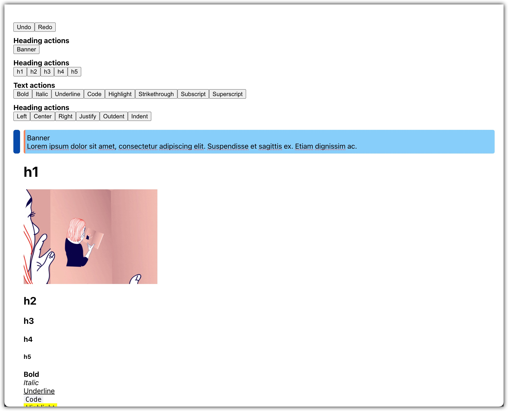
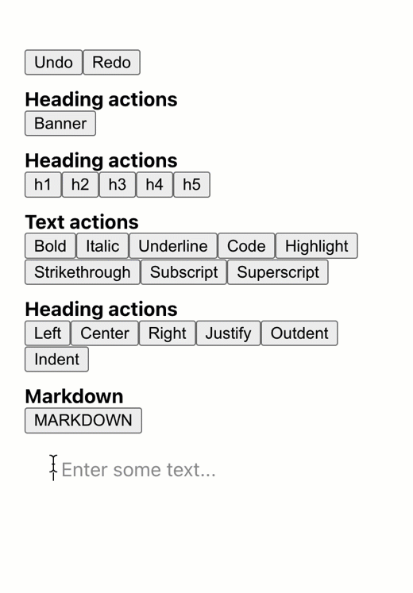
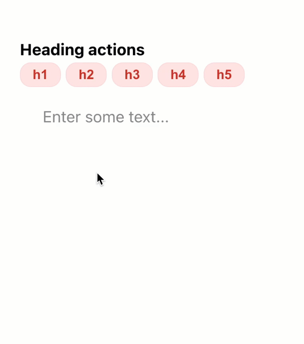

# [Part 1. Getting Started with Lexical](https://artem-diashkin.medium.com/getting-started-with-lexical-2c8b94c9bdd9).

## Tutorial on how to use Lexical with React JS; Basics with examples.

### What will be covered:
- Prerequisites
- Start
- History plugin
- Nodes
- Rich Text
- Theme
- Headings. Helpers and nodes config.
- How to create your own command with the payload
- How to create a custom Node

---

# [Part 2. Lexical JS with React. Hot to create a draggable block with image drop.](https://medium.com/@artem-diashkin/lexical-js-with-react-hot-to-create-a-draggable-element-5b106c5c003d)

## Tutorial on creating a draggable element with Lexical JS; Basics with examples.

### What will be covered:
- Prerequisites
- Getting started
- Hover styles
- Add draggable element on hover
- Add “on drag enter” event handlers
- Add “on drop” event handlers
- Reset state after drop event
- Final touch
- Image/s drop

# [Part 3. Lexical. How To Use Markdown Plugin](https://medium.com/@artem-diashkin/lexical-how-to-use-markdown-plugin-5b4fd3719298)

### What will be covered:
- Transformers
- MarkdownShortcutPlugin
- Disable draggable element on markdown mode

# [Part 4. Lexical. How To Use Link Plugins.](https://artem-diashkin.medium.com/lexical-how-to-use-link-plugins-d9a7734977a0)

## Tutorial on how to use Lexical Link Plugins with React: LinkPlugin, AutoLinkPlugin, LexicalClickableLinkPlugin

### What will be covered
- `LinkPlugin` (wrap node with a link on link paste)
- `AutoLinkPlugin` (automatically wrap with a link on text change)
- `LexicalClickableLinkPlugin` (redirect by clicking on a link in edit mode)

# [Part 5. Lexical - How To Add Node's Placeholder]()

## Tutorial on how to add a placeholder to the Lexical's empty Node element.

### What will be covered
